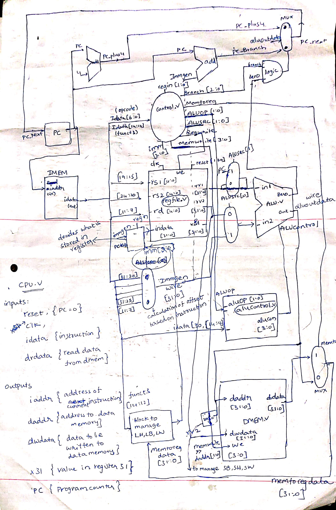
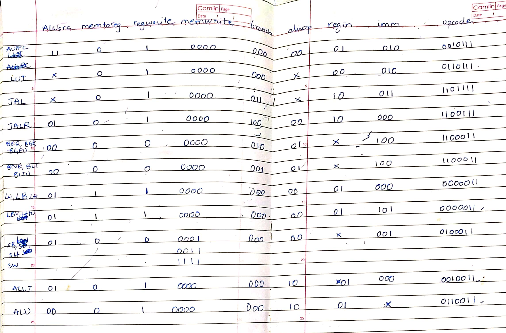

# Single-cycle CPU implementation

Now that we successfully implemented ALU, DMEM, IMEM, REGFILE which are impoertant parts of a processor, we almost finished 25% of our work. Now we should write a CONTROL UNIT to decide what to do for each instruction and PC (Program Counter) to maintain flow of instructions.  
My approach is similar to that of the idea in chapter 4 of book **Computer Organisation and Design by Hennessy and Patterson**.

**Goal :** Implement a single cycle CPU

### Assumptions
- IMEM and DMEM are capable of combinational read, and DMEM does clocked write (value in memory updated at clock edge).  
- IMEM and DMEM sizes will be restricted so that it can be implemented on the available hardware - you do not have to implement them.  
- Instruction memory databus width is 32 bits, so you always read back 32 bit data. But the address you get will be a byte address, which means you need to truncate to nearest multiple of 4 and read that value. For example, if IADDR=0, 1, 2 or 3 the same 32-bit value will be returned, similarly 4-7 etc.  
- Data memory should be capable of byte, half-word and word reads and writes, but the databus width is always 32 bits.  
  - For reading: DADDR=0,1,2,3 will all return the same value, but inside the CPU you should extract the correct byte or half-word. We will use the notation that DMEM[addr] returns a 32-bit value, while DMEMB[addr] is the byte value stored at the exact address.
  - Example: assume DMEM[0] contains the 32-bit value 0x12345678. Because this is a little-endian system, it will be stored as DMEMB[0] = 0x78, DMEMB[1] = 0x56, DMEMB[2] = 0x34, DMEMB[3] = 0x12. Assume x2=0
    - LW x1, 0(x2) will result in x1 = 0x12345678
    - LH x1, 0(x2) => x1 = 0x00005678
    - LH x1, 2(x2) => x1 = 0x00001234
    - LH x1, 1(x2) is a misaligned access error - you can ignore this for now
    - LB x1, 0(x2) => x1 = 0x00000078
    - LB x1, 1(x2) => x1 = 0x00000056  
  - For writing, you should update only the appropriate values. To enable this, assume that you have 4 separate write enable signals we[0:3], and the appropriate value should be written.
  - Example, assume for each of the below that DMEM[0] = 0x12345678 as before, x2=0, and x1=0xabcdef90
    - SW x1, 0(x2) => we[3:0] = 1111, DMEM[0] = 0xabcdef90
    - SH x1, 0(x2) => we[3:0] = 0011, DMEM[0] = 0x1234ef90
    - SH x1, 2(x2) => we[3:0] = 1100, DMEM[0] = 0xef905678
    - SH x1, 1(x2) is a misaligned access error
    - SB x1, 0(x2) => we[3:0] = 0001, DMEM[0] = 0x12345690
    - SB x1, 1(x2) => we[3:0] = 0010, DMEM[0] = 0x12349078  
  - Note for writing: the DMEM does not know whether you are trying to write a byte or half-word, so the shifting of data before writing has to be done inside the CPU itself. The we signal is only used to enable the appropriate byte writes, and will not do any shifting of the data.  

### Module interface  
```
module CPU(
    input clk,
    input reset,
    output [31:0] iaddr,  // address to instruction memory
    input [31:0] idata,   // data from instruction memory
    output [31:0] daddr,  // address to data memory
    input [31:0] drdata,  // data read from data memory
    output [31:0] dwdata, // data to be written to data memory
    output [3:0] we,      // write enable signal for each byte of 32-b word
    // Additional outputs for debugging
    output [31:0] x31,
    output [31:0] pc
)
```  
### RV32I Base Integer Instruction Set


We are neglecting last three instructions for now. (`FENCE`, `ECALL`, `EBREAK`).  
To know the basics of each instruction, you can refer [this](https://rv8.io/isa.html).  

## How I did it..
To decode what instruction does, we need to check it's `opcode` which are lowest 7 bits of the given 32-bit instruction and we should activate some signals and deactivate signals based on that. That's where Control Unit comes into picture.  
Control Unit manages the signals based on the instruction. For example, for an `LD` instruction - it sets register file `we`(write enable) as high and for `ST` instruction - it sets `we` for `DMEM` as high etc.

### My proposed CPU block diagram
  

Now, we should prepare the control unit based on above block diagram.
## Control unit
### ALUsrc [1:0]
`ALUsrc` decides the input of `ALU` which are `in1` and `in2`.   

| ALUsrc[1]      | `in1` |  
| ----------- | ----------- |  
| 0      | `rv1`       |  
| 1   | `PC`        |  

| ALUsrc[0]      | `in2` |  
| ----------- | ----------- |  
| 0      | `rv2`       |  
| 1   | `immgen`        |  

### memtoreg
It decides whether `drdata` or `aluout` should go to `indataforreg` for `regfile`.  

| memtoreg      | `indataforreg` |  
| ----------- | ----------- |  
| 0      | `aluoutdata`       |  
| 1   | `drdata`        | 

### regwrite
It is directly mapped to `we` (write enable) of `regfile`. 

### memwrite [3:0]
It decides `we` of `dmem`. 

| instr      | `memwrite` |  
| ----------- | ----------- |  
| `SW`      | `1111`       |  
| `SH`  | `0011`        | 
| `SB`  | `0001`        | 
| others   | `0000`|

It is directly mapped to `we` of `dmem` though. A logic in CPU decides `we` based on which bytes are being addressed.  

### branch [2:0]
It provides logic to find next instruction address for `JAL` or `BEQ` type instructions. 

|  instr     | `branch` |  
| ----------- | ----------- |  
| non-branch type      | `000`       |  
| branch if zero type  | `010`        | 
| branch if not zero type  | `001`        | 
| `JAL`   | `011`|
| `JALR`   | `100`|

### aluop [1:0]
It provides logic for ALU operation

| `aluop`      | operation of ALU |  
| ----------- | ----------- |  
| `00`      | always `add`       |  
| `01`  | `sub` or `slt` or `sltu`        | 
| `10`  | normal         | 

### regin [1:0]
It decides `indata` for `regfile`.

| `regin`      | `indata` |  
| ----------- | ----------- |  
| `00`      |  `immgen`       |  
| `01`  | `indataforreg`        | 
| `10`  | `PC_plus4`         | 

### imm[2:0]
It calculates offset (`immgen`) from `idata`.

|  instr     | `imm` |  
| ----------- | ----------- |  
| I-type      | `000`       |  
| U-type  | `010`        | 
| S-type  | `001`        | 
| J-type   | `011`|
| B-type   | `100`|
| IU-type   | `101`|

Based on above signals, outputs of control unit looks like this.


## Finally..
- Yeah !! That's it !!. Based on your architecture define Control Unit and output signals accordingly. Now wire CPU based on signals and the instruction. As simple as that.  
- You can find my CPU wiring in `CPU.v`. I written Conttrol Unit in `control.v`, Program Counter in `PC.v`, ALU in `alu.v`, ALUcontrol in `alucontrol.v`, did offset calculation in `immgen.v` and imported everything to `CPU` module at last.  
- We can connect `imem.v` and `dmem.v` to `CPU.v` in a testbench file `cpu_tb.v` and can simulate given instruction sets.  

- `imem1_ini.mem` to `imem5_ini.mem` contains some instruction sets for storing in `imem.v`. If your code is correct, `x31` should be 0 after all instructions for all 5 `.mem` files (for debugging). 
