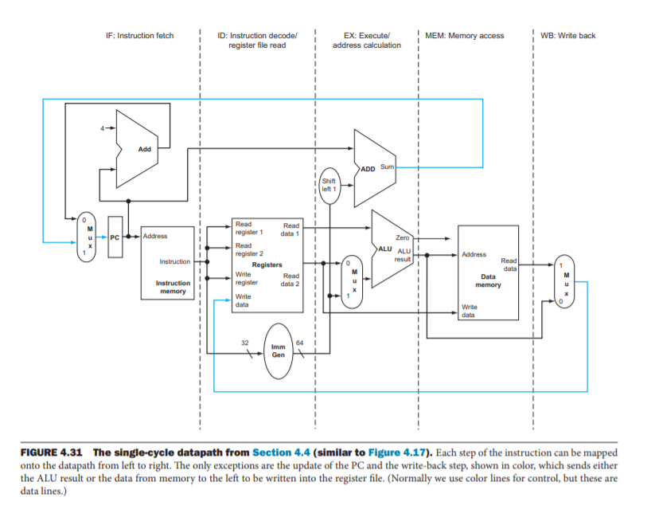
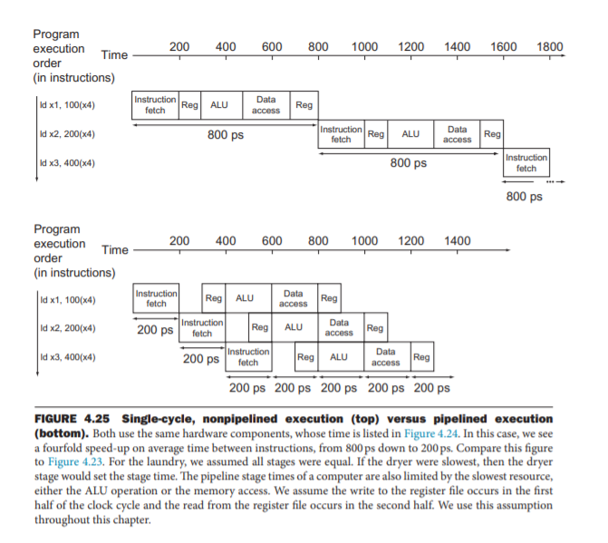
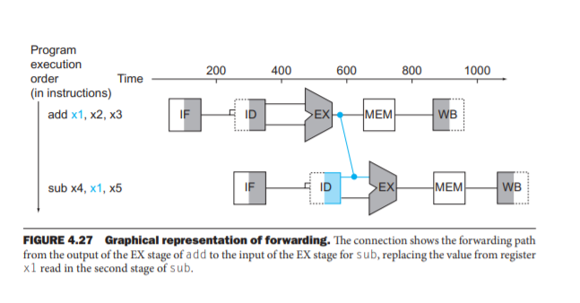
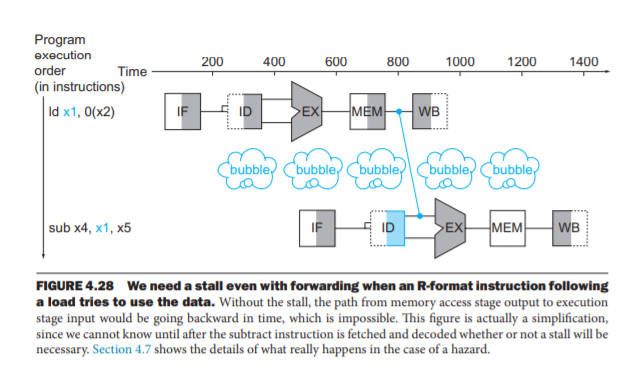
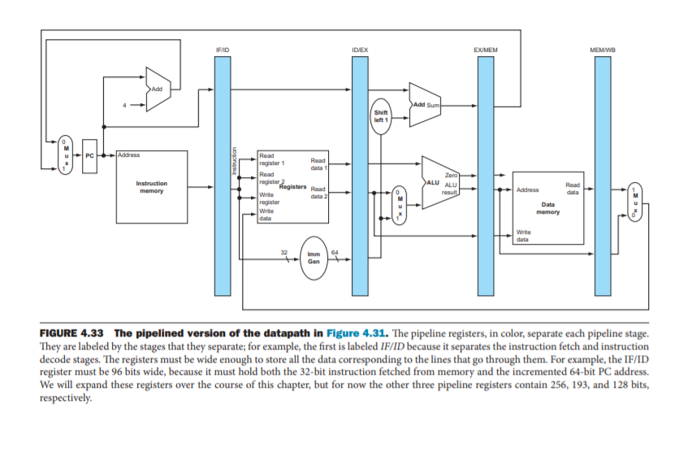
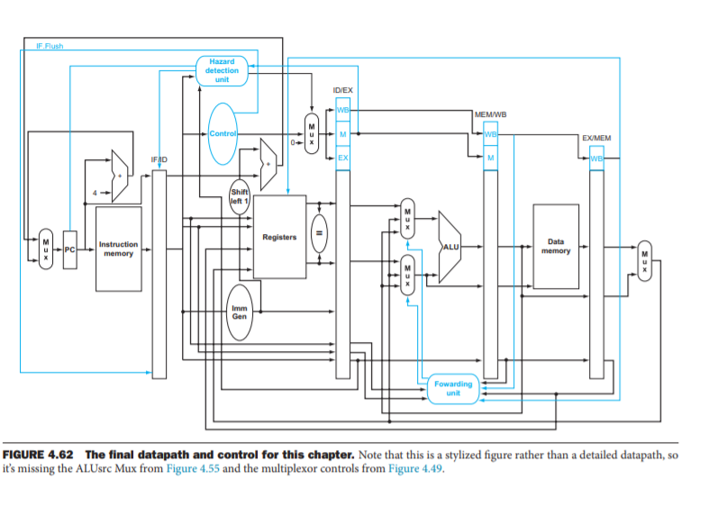

# Assignment 4 - Pipelined CPU
Implement a pipelined version of the single-cycle CPU designed in assignment 3. 

Required in submission:

- Clear block diagram of the components
- Comments and explanation in the Verilog code indicating which part of code corresponds to which part of the diagram
- Analysis of the performance: based on synthesis reports, what is the best clock speed at which the system can run  

The minimum expectation is functional correctness - all instructions must execute properly. In addition to that, forwarding and hazard detection are also required, but if not fully implemented, there should be explanations of how to get around the problems.
## How I did it
Each instruction has 5 stages.  
- Instruction Fetch (IF)
- Instruction Decode (ID)
- Execution (EX)
- Memory Access (MEM)
- Write Back (WB)  
  
  
### Removing Data hazards by forwarding
  
  
**We use New Registers for storing `wire`s of each instruction and carrying them to next cycle like this.**

## Final Pipeline Block Diagram

- Above pictures are screenshots from the book "Computer Architecture, A Quantitative Approach" by Hennessy and Patterson. My block diagram is not exactly same, but I made a few changes to it for pipelining all types of RISC instructions. 
- Yeah !! That's it !!. Based on your architecture define Control Unit and output signals accordingly. Now wire CPU based on signals and the instruction. As simple as that.  
- You can find my CPU wiring in `CPU.v`. I written Conttrol Unit in `control.v`, Program Counter in `PC.v`, ALU in `alu.v`, ALUcontrol in `alucontrol.v`, did offset calculation in `immgen.v` and imported everything to `CPU` module at last.  
- We can connect `imem.v` and `dmem.v` to `CPU.v` in a testbench file `cpu_tb.v` and can simulate given instruction sets.  

- `imem1_ini.mem` to `imem5_ini.mem` contains some instruction sets for storing in `imem.v`. If your code is correct, `x31` should be 0 after all instructions for all 5 `.mem` files (for debugging). 
